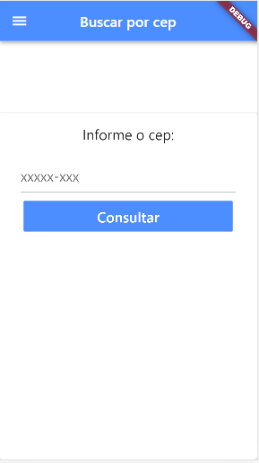
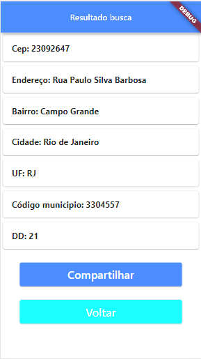

# ConsultaCep-Flutter
 
Aplicativo para buscar detalhes de um endereço a partir de um cep informado pelo usuário. Utilizando o framework flutter e a awesomeapi cep.

 <a target="_blank" href="https://docs.awesomeapi.com.br/api-cep">Documentação da awesomeapi cep</a> 

 <h3>Requisitos:</h3>
    <blockquote>
       Ter o flutter instalado em seu computador  
       Aconselho executar o <code>C:\src\flutter>flutter doctor</code> no cmd, caso falte alguns do componentes faça a instalação!
       <a target="_blank" href="https://flutter.dev/docs/get-started/install/windows">Documentação instalação flutter</a>
    </blockquote>

<h3>Instalação: </h3>
<blockquote>
    clonar este repositório para um diretório de sua preferência e executar em um emulador (android studio, genymotion ou até mesmo no navegador, caso utilize o vscode será possível executar no google chrome, edge...)
</blockquote>
 <a href="ApkGit/consultaCep.apk">Download do apk</a> 

<h3>Imagens do projeto</h3>
<figure>
    <figcaption>Telas iniciais e de retorno dos dados:</figcaption>
    
    
    
</figure>

